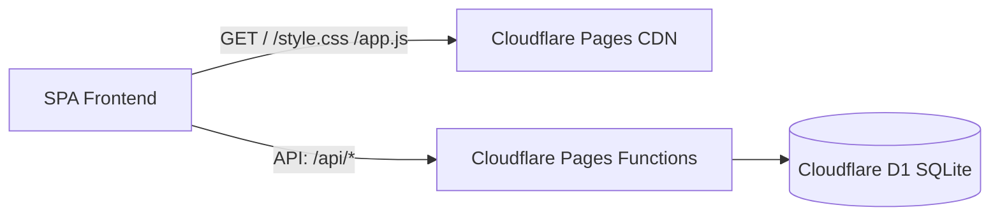

# Доступные деньги (Money Tracker)

Трекер доступных денег и долгов. Работает на **Cloudflare Pages + Pages Functions + Cloudflare D1 (serverless SQLite)**, а также поддерживает локальный запуск.

## Архитектура



- **Frontend:** чистый HTML, CSS и Vanilla JS без тяжелых фреймворков.
- **Backend:** Cloudflare Pages Functions (`/functions/api/...`).
- **База данных:** Cloudflare D1 (serverless SQLite с автоматической инициализацией схемы).

---

## Локальная разработка

### Вариант 1: Через Wrangler (Cloudflare эмуляция)

Требуется Node.js (v18+):

```bash
# Установка зависимостей
npm install

# Запуск локального dev-сервера с локальной D1 базой данных
npm run dev
```

Приложение откроется на [http://127.0.0.1:8788](http://127.0.0.1:8788).

### Вариант 2: Через Python (резервный локальный запуск)

```bash
python3.14 app.py
```

Приложение откроется на [http://127.0.0.1:8080](http://127.0.0.1:8080). Данные сохраняются в `data/ledger.db`.

---

## Деплой на Cloudflare Pages

### Шаг 1. Создать базу данных Cloudflare D1

Через терминал с помощью Wrangler:

```bash
npx wrangler d1 create money-tracker-db
```

Команда выведет `database_id`. Скопируйте его и укажите в файле `wrangler.toml`:

```toml
[[d1_databases]]
binding = "DB"
database_name = "money-tracker-db"
database_id = "ВАШ_DATABASE_ID_ИЗ_КОМАНДЫ"
```

*(Опционально)* Инициализировать схему вручную в удаленной базе:

```bash
npm run db:init:remote
```
*(При первом запуске функции также автоматически создадут таблицы, если их нет).*

---

### Шаг 2. Выбор способа деплоя

#### Способ А: Прямая интеграция с GitHub (Рекомендуемый, самый простой)

1. Откройте панель **Cloudflare Dashboard** -> **Workers & Pages** -> **Create application** -> вкладка **Pages** -> **Connect to Git**.
2. Выберите репозиторий `kr0t/money-tracker`.
3. Настройки сборки:
   - **Framework preset:** `None`
   - **Build command:** *(оставить пустым)*
   - **Build output directory:** `public`
4. Нажмите **Save and Deploy**.
5. **Привязка D1 к Pages:**
   - В созданном проекте Pages перейдите в **Settings** -> **Functions** -> раздел **D1 database bindings**.
   - Нажмите **Add binding**:
     - Variable name: `DB`
     - D1 database: `money-tracker-db`
   - Нажмите **Save**.
6. Переразверните проект (вкладка **Deployments** -> **Retry deployment**).

---

#### Способ Б: Деплой через GitHub Actions

Если вы хотите использовать workflow `.github/workflows/deploy.yml`:

1. В Cloudflare Dashboard создайте API токен (User Profile -> **API Tokens** -> **Create Token** -> шаблон **Edit Cloudflare Workers** или права на Pages).
2. В репозитории GitHub перейдите в **Settings** -> **Secrets and variables** -> **Actions** и добавьте:
   - `CLOUDFLARE_API_TOKEN` — ваш API токен Cloudflare.
   - `CLOUDFLARE_ACCOUNT_ID` — ID аккаунта Cloudflare (виден в адресной строке или на главной странице дашборда).
3. При каждом `git push` в ветку `main` деплой выполнится автоматически.

---

## Возможности

- Отображение текущего доступного баланса
- Ведение нескольких отдельных долгов («Добавить долг»)
- Внесение поступлений и расходов
- Возврат долга со списанием из «Доступно» в одно действие
- История операций и очистка истории
- Адаптивный интерфейс (смартфон / десктоп)
