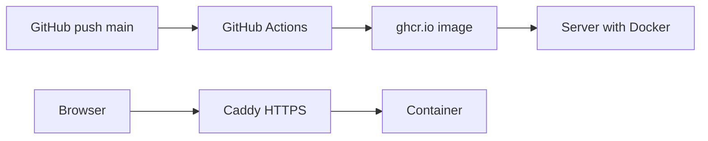

# Доступные деньги

Локальный трекер остатка после зарплат и трат. Только стандартная библиотека Python 3.14.

## Локальный запуск

```bash
python3.14 app.py
```

Откройте в браузере: [http://127.0.0.1:8080](http://127.0.0.1:8080)

Данные хранятся в `data/ledger.db` (файл создаётся при первом запуске).

## Docker

```bash
docker compose up --build
```

Приложение будет доступно на [http://127.0.0.1:8080](http://127.0.0.1:8080). База SQLite сохраняется в Docker volume `money_data`.

Переменные окружения:

| Переменная | По умолчанию | Описание |
|------------|--------------|----------|
| `HOST` | `127.0.0.1` | Адрес прослушивания |
| `PORT` | `8080` | Порт |
| `DATA_DIR` | `./data` | Каталог для SQLite |

## Деплой (Docker + GitHub Actions)

Любой VPS или сервер с Docker, публичным IP и доступом по SSH. На сервер попадает только Docker-образ из GHCR — исходники не копируются.



### 1. Подготовка сервера (один раз)

Требования: Linux (Ubuntu 22.04/24.04 или аналог), Docker + Compose plugin, открытые порты 80 и 443.

```bash
docker volume create money_data
sudo mkdir -p /opt/money-tracker
```

Скопируйте на сервер файлы из `deploy/`:

```bash
scp deploy/docker-compose.prod.yml deploy/Caddyfile deploy/.env.example user@SERVER:/opt/money-tracker/
ssh user@SERVER
cd /opt/money-tracker
cp .env.example .env
```

Заполните `.env`:

```env
APP_IMAGE=ghcr.io/OWNER/REPO:latest
CADDY_DOMAIN=money.example.ru
BASIC_AUTH_HASH=<bcrypt-хеш>
```

Сгенерируйте хеш пароля для basic auth:

```bash
docker run --rm caddy:2-alpine caddy hash-password --plaintext 'your-password'
```

Настройте DNS: A-запись `CADDY_DOMAIN` → IP сервера.

Сделайте GHCR package публичным (Settings → Packages) или выполните `docker login ghcr.io` на сервере, чтобы `docker pull` работал.

Первый запуск вручную (после появления образа в GHCR):

```bash
cd /opt/money-tracker
docker compose -f docker-compose.prod.yml pull
docker compose -f docker-compose.prod.yml up -d
```

### 2. Secrets в GitHub

Settings → Secrets and variables → Actions:

| Secret | Описание |
|--------|----------|
| `DEPLOY_HOST` | IP или hostname сервера |
| `DEPLOY_USER` | SSH-пользователь |
| `DEPLOY_SSH_KEY` | Приватный SSH-ключ |

### 3. CI/CD

При push в `main` workflow `.github/workflows/deploy.yml`:

1. **test** — сборка образа и healthcheck `GET /api/summary`
2. **build-and-push** — push в `ghcr.io/<owner>/<repo>:latest`
3. **deploy** — SSH на сервер: `docker compose pull && up -d`

## Возможности

- Текущий доступный баланс
- Несколько отдельных долгов («Добавить долг»)
- Поступления и траты
- Возврат долга с автосписанием из «Доступно»
- История операций и очистка

Страница адаптирована под ноутбук и мобильный экран.
