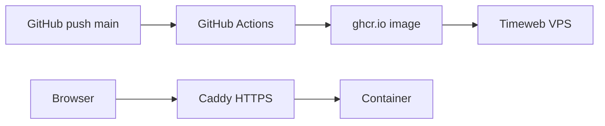

# Доступные деньги

Локальный трекер остатка после зарплат и трат. Только стандартная библиотека Python 3.14.

## Локальный запуск

```bash
python3.14 app.py
```

Откройте в браузере: [http://127.0.0.1:8080](http://127.0.0.1:8080)

Данные хранятся в `data/ledger.db` (файл создаётся при первом запуске).

## Docker

```bash
docker compose up --build
```

Приложение будет доступно на [http://127.0.0.1:8080](http://127.0.0.1:8080). База SQLite сохраняется в Docker volume `money_data`.

Переменные окружения:

| Переменная | По умолчанию | Описание |
|------------|--------------|----------|
| `HOST` | `127.0.0.1` | Адрес прослушивания |
| `PORT` | `8080` | Порт |
| `DATA_DIR` | `./data` | Каталог для SQLite |

## Деплой (Timeweb Cloud VPS + GitHub Actions)



На сервер попадает только Docker-образ. Исходники не копируются.

### 1. Bootstrap VPS (один раз)

1. Создайте VPS в [Timeweb Cloud](https://timeweb.cloud) (Ubuntu 22.04/24.04).
2. Установите Docker и Compose plugin.
3. Создайте volume и каталог:

```bash
docker volume create money_data
sudo mkdir -p /opt/money-tracker
```

4. Скопируйте на VPS файлы из `deploy/`:

```bash
scp deploy/docker-compose.prod.yml deploy/Caddyfile deploy/.env.example user@SERVER:/opt/money-tracker/
ssh user@SERVER
cd /opt/money-tracker
cp .env.example .env
# отредактируйте .env
```

5. Настройте `.env`:

```env
APP_IMAGE=ghcr.io/OWNER/REPO:latest
CADDY_DOMAIN=money.example.ru
BASIC_AUTH_HASH=<bcrypt-хеш>
```

6. Сгенерируйте пароль для basic auth:

```bash
docker run --rm caddy:2-alpine caddy hash-password --plaintext 'your-password'
```

7. Настройте DNS: A-запись `CADDY_DOMAIN` → IP VPS. Откройте порты 80 и 443.

8. Сделайте GHCR package public (Settings → Package settings) или настройте `docker login` на VPS для pull.

### 2. Secrets в GitHub

Settings → Secrets and variables → Actions:

| Secret | Описание |
|--------|----------|
| `DEPLOY_HOST` | IP VPS |
| `DEPLOY_USER` | SSH-пользователь |
| `DEPLOY_SSH_KEY` | Приватный SSH-ключ |

### 3. CI/CD

При push в `main`:

1. **test** — сборка образа и healthcheck `/api/summary`
2. **build-and-push** — push в `ghcr.io/<owner>/<repo>:latest`
3. **deploy** — SSH на VPS: `docker compose pull && up -d`

## Возможности

- Показать текущий доступный баланс
- Несколько отдельных долгов с кнопкой «Добавить долг»
- Зачислить поступление (зарплата и т.п.)
- Списать трату
- Возврат долга с автосписанием из «Доступно»
- Список последних операций
- Очистка истории

Страница адаптирована под ноутбук и мобильный экран.
