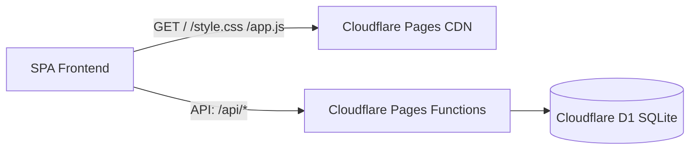

# Доступные деньги (Money Tracker)

[](https://github.com/kr0t/money-tracker/actions/workflows/ci.yml)

Трекер доступных денег и долгов. Работает на **Cloudflare Pages + Pages Functions + Cloudflare D1 (serverless SQLite)**, а также поддерживает локальный запуск.

## Архитектура



- **Frontend:** чистый HTML, CSS и Vanilla JS без тяжелых фреймворков.
- **Backend:** Cloudflare Pages Functions (`/functions/api/...`).
- **База данных:** Cloudflare D1 (serverless SQLite с автоматической инициализацией схемы).

---

## Локальная разработка

### Вариант 1: Через Wrangler (Cloudflare эмуляция)

Требуется Node.js (v18+):

```bash
# Установка зависимостей
npm install

# Запуск локального dev-сервера с локальной D1 базой данных
npm run dev
```

Приложение откроется на [http://127.0.0.1:8788](http://127.0.0.1:8788).

### Вариант 2: Через Python (резервный локальный запуск)

Требуются переменные окружения `AUTH_PIN` и `AUTH_SECRET` (сервер без них не запустится):

```bash
AUTH_PIN="ваш_пин" AUTH_SECRET="$(openssl rand -hex 32)" python3.14 app.py
```

Приложение откроется на [http://127.0.0.1:8080](http://127.0.0.1:8080). Данные сохраняются в `data/ledger.db`.

Опционально: `AUTH_MAX_ATTEMPTS` (по умолчанию 5) и `AUTH_LOCKOUT_WINDOW_SECONDS` (по умолчанию 900) — параметры блокировки после неудачных попыток входа.

---

## Тесты

Юнит-тесты без зависимостей (stdlib):

```bash
python3 -m unittest discover -s tests -p "test_*.py" -v   # Python-логика: парсинг сумм, токены, БД
npm test                                                  # JS-логика (node:test): парсинг сумм, auth
```

E2E-проверки против запущенного инстанса (затирают данные — только одноразовые инстансы):

```bash
BASE_URL=http://127.0.0.1:8788 AUTH_PIN=… ./scripts/auth_smoke.sh
BASE_URL=http://127.0.0.1:8788 AUTH_PIN=… CONFIRM_DESTRUCTIVE=1 python3 scripts/integrity_check.py
```

CI (`.github/workflows/ci.yml`) на каждый push/PR запускает оба набора тестов
и обе e2e-проверки против обоих бэкендов (Python-сервер и wrangler pages dev с локальной D1).

---

## Деплой на Cloudflare Pages

### Шаг 1. Создать базу данных Cloudflare D1

Через терминал с помощью Wrangler:

```bash
npx wrangler d1 create money-tracker-db
```

Команда выведет `database_id`. Скопируйте его и укажите в файле `wrangler.toml`:

```toml
[[d1_databases]]
binding = "DB"
database_name = "money-tracker-db"
database_id = "ВАШ_DATABASE_ID_ИЗ_КОМАНДЫ"
```

*(Опционально)* Инициализировать схему вручную в удаленной базе:

```bash
npm run db:init:remote
```
*(При первом запуске функции также автоматически создадут таблицы, если их нет).*

---

### Шаг 2. Деплой через интеграцию Cloudflare с GitHub

1. Откройте панель **Cloudflare Dashboard** -> **Workers & Pages** -> **Create application** -> вкладка **Pages** -> **Connect to Git**.
2. Выберите репозиторий `kr0t/money-tracker`.
3. Настройки сборки:
   - **Framework preset:** `None`
   - **Build command:** *(оставить пустым)*
   - **Build output directory:** `public`
4. Нажмите **Save and Deploy**.
5. **Привязка D1 к Pages:**
   - В созданном проекте Pages перейдите в **Settings** -> **Functions** -> раздел **D1 database bindings**.
   - Нажмите **Add binding**:
     - Variable name: `DB`
     - D1 database: `money-tracker-db`
   - Нажмите **Save**.
6. **Настройка авторизации (обязательно):**
   - В настройках проекта Pages перейдите в **Settings** -> **Environment variables** (или **Variables and Secrets**).
   - Добавьте две переменные (рекомендуется тип **Secret**, значения шифруются):
     - Variable name: `AUTH_PIN`
     - Value: `ваш_пин_или_пароль`
     - Variable name: `AUTH_SECRET`
     - Value: случайная строка не короче 16 символов, например результат `openssl rand -hex 32`
   - Нажмите **Save**.
   - Без любой из этих переменных приложение работать не будет: вход вернёт ошибку «Сервер не настроен».
7. Переразверните проект (вкладка **Deployments** -> **Retry deployment**).

---

## Авторизация по PIN-коду

- Доступ к приложению защищен экраном ввода PIN-кода / пароля.
- После успешного входа создается защищенная сессия (HttpOnly Cookie на 30 дней с HMAC-SHA256 подписью).
- **`AUTH_PIN` и `AUTH_SECRET` обязательны** для любого способа запуска (Pages, wrangler dev, Python, Docker). Дефолтных значений нет: без переменных вход невозможен (fail-closed).
- `AUTH_SECRET` — отдельный секрет для подписи токенов, не должен совпадать с PIN и быть короче 16 символов. Сгенерируйте: `openssl rand -hex 32`.
- Защита от подбора: после 5 неудачных попыток входа с одного IP в течение 15 минут возвращается 429. Настраивается через `AUTH_MAX_ATTEMPTS` и `AUTH_LOCKOUT_WINDOW_SECONDS`.
- Смена `AUTH_SECRET` или `AUTH_PIN` инвалидирует все существующие сессии (нужно перелогиниться).
- Для локальной разработки скопируйте `.dev.vars.example` в `.dev.vars` (файл игнорируется git'ом):
  ```bash
  cp .dev.vars.example .dev.vars
  ```
- Для локального Docker: скопируйте `.env.example` в `.env` (тоже игнорируется git'ом).

---

## Возможности

- Защита приложения PIN-кодом / паролем с экраном блокировки
- Отображение текущего доступного баланса
- Статус обратного отсчета до следующего поступления (5-е и 20-е числа)
- Ведение нескольких отдельных долгов («Добавить долг»)
- Внесение поступлений и расходов
- Возврат долга со списанием из «Доступно» в одно действие
- История операций и очистка истории
- Адаптивный интерфейс (смартфон / десктоп)
